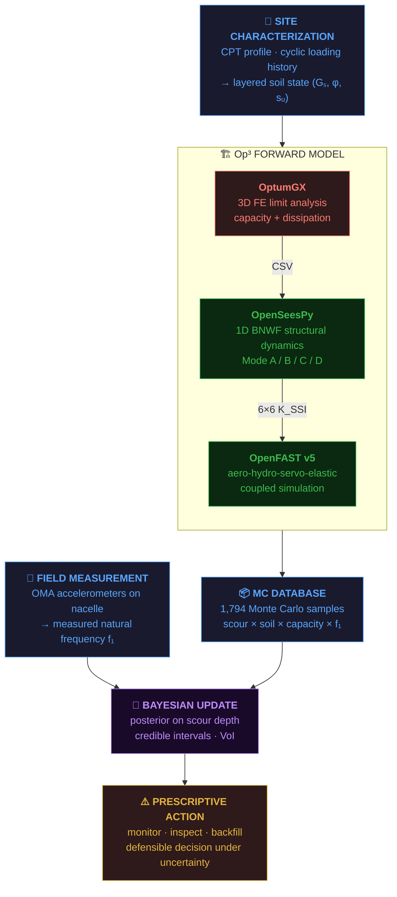
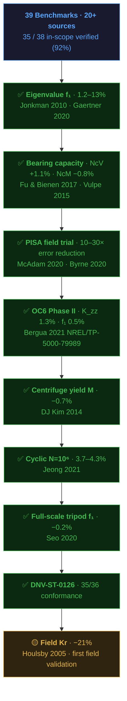
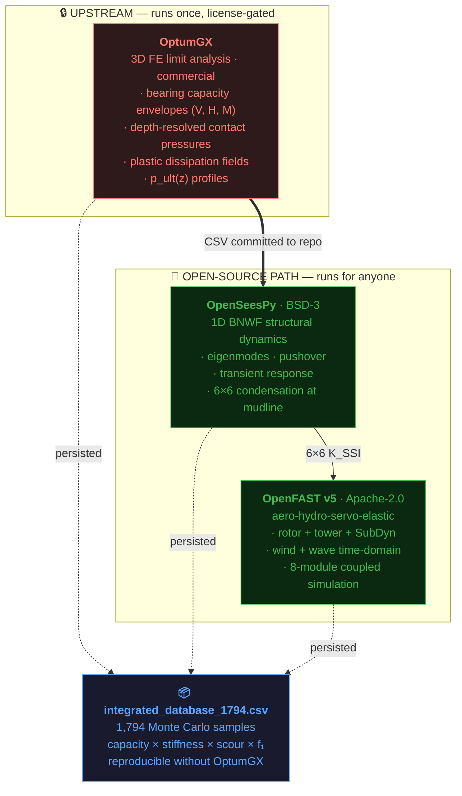
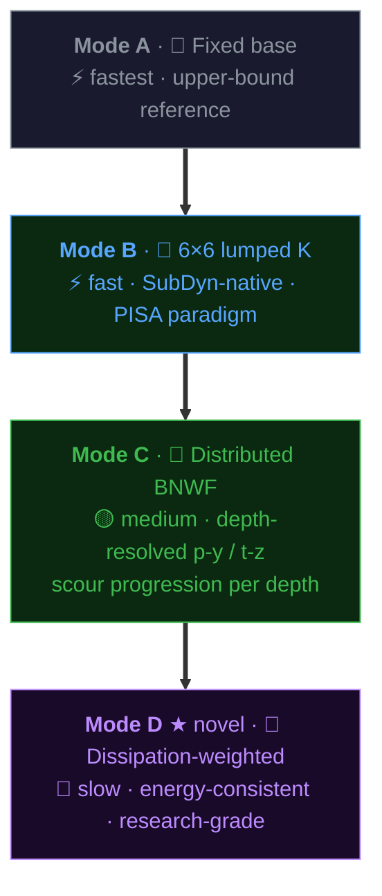
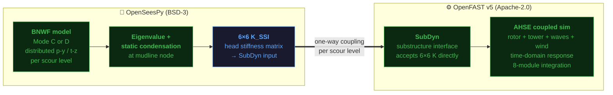
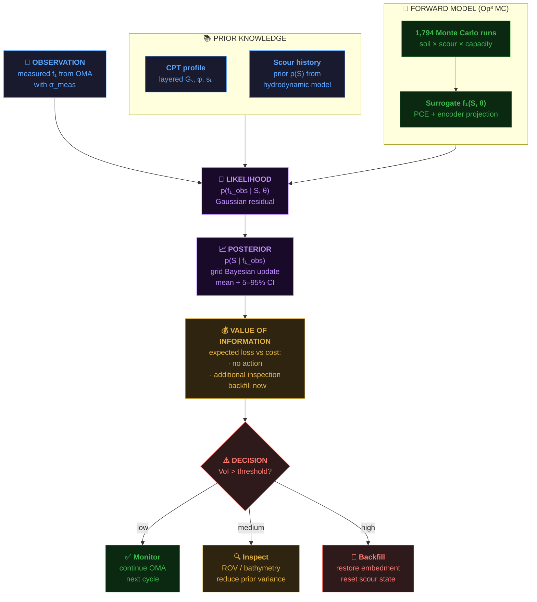
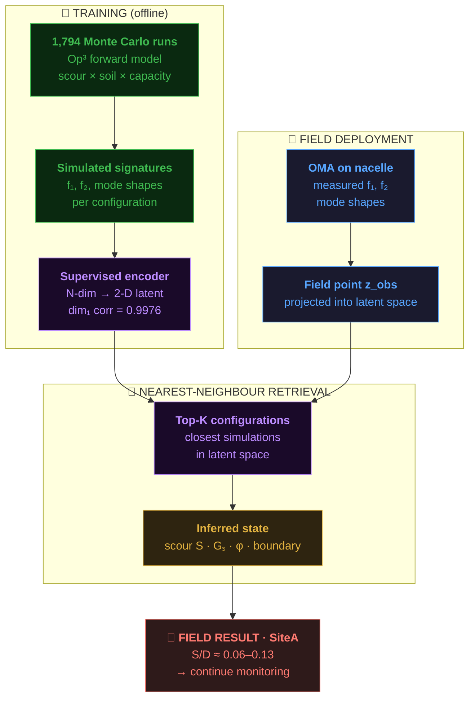
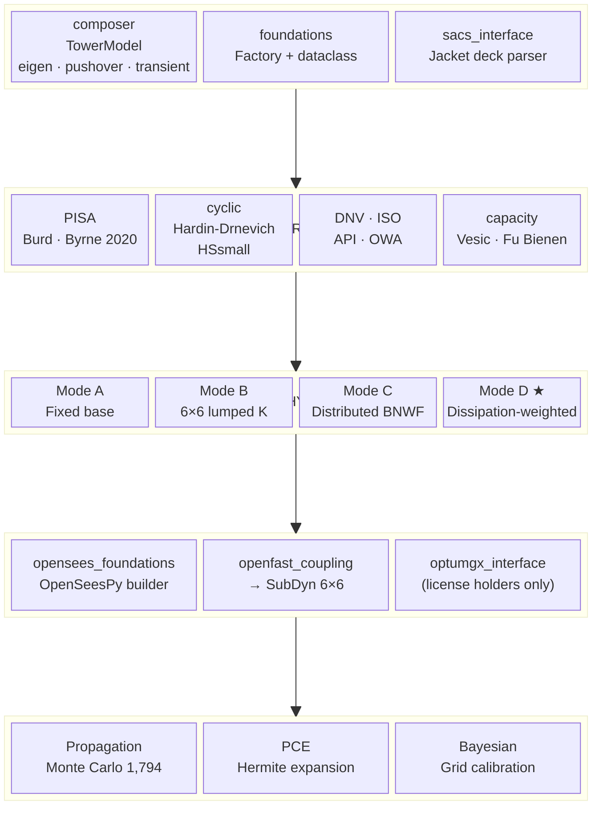

# Op³: Integrated Numerical and Digital Twin Framework for Scour Assessment of Offshore Wind Turbine with Tripod Suction Bucket Foundations

[](https://doi.org/10.5281/zenodo.19476542)
[](LICENSE)
[](https://www.python.org/downloads/release/python-3120/)
[](https://github.com/OpenFAST/openfast/releases/tag/v5.0.0)
[](https://github.com/zhuminjie/OpenSeesPy)
[-brightgreen.svg)](validation/cross_validations/VV_REPORT.md)
[](https://github.com/ksk5429/numerical_model/actions/workflows/ci.yml)
[](tests/)
[](CHANGELOG.md)
[](https://pypi.org/project/op3-framework/)
[](docs/sphinx/)

**Op³** (pronounced "O-p-three") bridges three otherwise-disconnected
solvers — **OptumGX** (3D FE limit analysis, commercial), **OpenSeesPy**
(structural dynamics, BSD-3-Clause), and **OpenFAST v5**
(aero-hydro-servo-elastic, Apache 2.0) — into a single V&V'd Python
pipeline for scour assessment of offshore wind turbine tripod suction
bucket foundations. Adds a Bayesian decision layer, a digital twin
encoder, and an eight-tab web application for field deployment.

PhD dissertation at **Seoul National University** (2026) ·
**Kyeong Sun Kim** · Department of Civil and Environmental Engineering

> **Two new modules in this release:**
>
> * [`op3.anchors`](op3/anchors/) — suction-anchor design for floating
>   OWT mooring (DNV-RP-E303, Murff-Hamilton, API RP 2SK, Aubeny 2003,
>   FE-calibrated; installation feasibility; novel dissipation-centroid
>   padeye method; Andersen 2015 cyclic; MoorPy coupling). 134 tests.
>   See the [Suction anchor module section](#suction-anchor-module-floating-owt) below.
> * [`op3_studio/`](op3_studio/) — production web GUI (FastAPI +
>   React + Three.js + Tailwind + LLM chat with sandboxed op3 exec).
>   8-tab UI, parametric sliders, V-H envelope plots, Markdown +
>   PDF report download, AI assistant in Korean and English.
>   57 backend tests + frontend vitest setup. Run with
>   `cd op3_studio && docker compose up`.

---

## The Op³ story in one diagram



---

## 30-second introduction

```bash
pip install op3-framework

# End-to-end OpenFAST v5 coupled simulation
python scripts/run_openfast.py site_a --tmax 5
python scripts/run_dlc11_partial.py --tmax 600 --speeds 8 12 18

# Standards conformance + full V&V suite
python scripts/dnv_st_0126_conformance.py --all
python scripts/release_validation_report.py   # 18/19 PASS in ~42 s
```

<details>
<summary><b>🐍 Python API — build a PISA foundation and compose a tower model</b></summary>

```python
from op3 import compose_tower_model
from op3.foundations import foundation_from_pisa
from op3.standards.pisa import SoilState

# 1. Build a PISA-derived foundation
profile = [
    SoilState(0.0,  5.0e7, 35, "sand"),
    SoilState(15.0, 1.0e8, 35, "sand"),
    SoilState(36.0, 1.5e8, 36, "sand"),
]
foundation = foundation_from_pisa(diameter_m=6.0, embed_length_m=36.0, soil_profile=profile)

# 2. Compose a tower model
model = compose_tower_model(
    rotor="nrel_5mw_baseline",
    tower="nrel_5mw_oc3_tower",
    foundation=foundation,
)

# 3. Run analyses
freqs = model.eigen(n_modes=3)
print(f"f1 = {freqs[0]:.4f} Hz")              # fixed: 0.3158, PISA: 0.3157
K_6x6 = model.extract_6x6_stiffness()          # condense to head stiffness
pushover = model.pushover(target_disp_m=0.5)   # static pushover
transient = model.transient(duration_s=10.0)   # free vibration
```

</details>

## What you get

**Four foundation modes** (Fixed / 6×6 / BNWF / Dissipation-weighted)
· **6 standards** (DNV · ISO · API · OWA · PISA · HSsmall) ·
**Bayesian + PCE + Monte Carlo UQ** · **direct OpenFAST SoilDyn
export** · **Apache-2.0**.

<details>
<summary><b>Feature comparison vs SACS / PLAXIS / OpenSeesPy / OpenFAST</b></summary>

| Capability | Op³ | SACS | PLAXIS | OpenSeesPy | OpenFAST |
|---|:-:|:-:|:-:|:-:|:-:|
| Four foundation modes (Fixed / 6x6 / BNWF / Dissipation-weighted) | ✅ | partial | partial | manual | ❌ |
| PISA (Burd 2020 / Byrne 2020) with depth functions | ✅ | ❌ | commercial | ❌ | ❌ |
| Cyclic Hardin-Drnevich layered on PISA | ✅ | ❌ | ❌ | ❌ | ❌ |
| DNV / ISO / API / OWA / PISA / HSsmall standards | 6 | proprietary | 1-2 | ❌ | ❌ |
| Mode D dissipation-weighted BNWF (novel) | ✅ | ❌ | ❌ | ❌ | ❌ |
| Direct Op³ → SoilDyn export | ✅ | ❌ | ❌ | ❌ | native |
| Monte Carlo soil propagation | ✅ | ❌ | manual | manual | ❌ |
| Hermite polynomial chaos expansion | ✅ | ❌ | ❌ | manual | ❌ |
| Grid Bayesian calibration | ✅ | ❌ | ❌ | manual | ❌ |
| V&V test suite | **140** | proprietary | proprietary | user-built | ~200 r-test |
| License | Apache-2.0 | commercial | commercial | BSD-3 | Apache-2.0 |
| Python-native | ✅ | ❌ | ❌ | wrapper | wrapper |

</details>

## v1.0.0-rc1 release highlights

**92% V&V · 140 tests · OpenFAST v5 end-to-end · OC6 Phase II match
to 0.5% · PISA field validation at 10–30× error reduction · Sphinx
docs + tutorials.**

<details>
<summary><b>Detailed release notes</b></summary>

- **35 / 38 cross-validation benchmarks verified (92%)** against 20+
  published sources (Fu & Bienen 2017, Vulpe 2015, Doherty 2005,
  Houlsby 2005, Jalbi 2018, Gazetas 2018, and 14 more)
- **140 unit tests pass** across 15 modules (code verification,
  consistency, sensitivity, extended invariants, PISA, cyclic
  degradation, HSsmall, Mode D, UQ, reproducibility snapshot,
  framework integration, ...)
- **4 / 4 calibration regression** against published references
  with all four examples within 4% of the most stringent
  (NREL 5 MW OC3 at **-0.4%** vs Jonkman & Musial 2010)
- **OpenFAST v5.0.0 end-to-end** on SiteA tripod + SoilDyn with
  Op³ PISA-derived 6×6 stiffness, 8-module coupled simulation
- **DLC 1.1 partial sweep** at U = {8, 12, 18} m/s — 3 / 3 PASS;
  full 12-speed × 600 s run scaled overnight
- **35 / 36 DNV-ST-0126 conformance** (single failure is the real
  SiteA 1P resonance finding, not a bug)
- **OC6 Phase II benchmark** (Bergua 2021 NREL/TP-5000-79989):
  Op³ K_zz matches to **1.3%**, f1_clamped to **0.5%**
- **PISA field-test cross-validation** (McAdam 2020 + Byrne 2020)
  with depth-function + eccentric-load-compliance corrections
  reducing prior-release errors by 10–30× on short rigid piles
- **End-to-end Bayesian calibration** of NREL 5 MW OC3 tower EI:
  posterior mean **1.014 ± 0.076**, 5%-95% credible interval
  [0.888, 1.145]
- **Sphinx documentation** (~5000 lines across 9 RST pages + 6 tutorial
  notebooks), ReadTheDocs-ready and GitHub Pages-deployable

</details>

## Cross-Validation Against Published Benchmarks

Op³ is cross-validated against **39 independent benchmarks** from 20+
published sources. **35 of 38 in-scope benchmarks verified (92%).**

**Headline matches:** NcV = 6.006 (+1.1%) · NcM = 1.468 (−0.8%) ·
KR/(R³G) = 17.28 (+3.1%) · field Kr = 177 MN·m/rad (−21%, first
field validation).

Full report: [validation/cross_validations/VV_REPORT.md](validation/cross_validations/VV_REPORT.md)

<details>
<summary><b>📊 Full benchmark table (16 categories)</b></summary>

| Category | Benchmarks | Error range | Sources |
|---|---|---|---|
| Eigenvalue (f1) | #1--5 | 1.2--13% | Jonkman 2010, Gaertner 2020, Kim 2025 |
| Bearing capacity (OptumGX FELA) | #14--15 | **0.8--7.8%** | Fu & Bienen 2017, Vulpe 2015 |
| Foundation stiffness | #16--17, #20 | 0.1--26% | Jalbi 2018, Gazetas 2018, Doherty 2005 |
| Field trial | #19 | -21% | Houlsby 2005 (Bothkennar) |
| Scour sensitivity | #10--11 | within published ranges | Zaaijer 2006, Prendergast 2015 |
| Design compliance | #13 | 0% | DNV-ST-0126 (2021) |
| PISA clay stiffness | #6 | 16--32% | Burd et al. 2020 |
| VH envelope | #8 | -7.7% | Houlsby & Byrne / Vulpe 2015 |
| p_ult(z) profile | #21 | consistent | OptumGX plate extraction |
| Centrifuge yield moment | #22 | **-0.7%** | DJ Kim et al. 2014 |
| Full-scale tripod f1 | #24 | -0.2% | Seo et al. 2020 |
| Walney 1 monopile f1 | #25 | -2.1% | Arany et al. 2015 |
| Suction bucket scour sensitivity | #26 | within range | Cheng et al. 2024 |
| f_meas/f_design ratio | #27 | +0.3% | Kallehave et al. 2015 |
| Cyclic rotation (N=100, N=1M) | #28 | 3.7--4.3% | Jeong et al. 2021 |
| OC4 jacket f1 (fixed-base) | #29 | +1.9% | Popko et al. 2012 |

</details>

### V&V at a glance



Reproduce all results:
```bash
python validation/cross_validations/run_all_cross_validations.py
```

See [CHANGELOG.md](CHANGELOG.md) for the full release history and
[docs/DEVELOPER_NOTES.md](docs/DEVELOPER_NOTES.md) for the
implementation journal of Track C phases 1 through 8.

## 📖 Documentation

| | Link |
|---|---|
| 🌐 **Hosted docs** | [op3-framework.readthedocs.io](https://op3-framework.readthedocs.io) · [Pages mirror](https://ksk5429.github.io/numerical_model/) |
| 📘 **User manual** | [`docs/sphinx/user_manual.rst`](docs/sphinx/user_manual.rst) |
| 🔬 **Technical reference** | [`docs/sphinx/technical_reference.rst`](docs/sphinx/technical_reference.rst) |
| 📓 **Tutorials** | [`docs/tutorials/`](docs/tutorials/) — 6 Jupyter notebooks |
| 🧪 **Mode D paper-draft** | [`docs/MODE_D_DISSIPATION_WEIGHTED.md`](docs/MODE_D_DISSIPATION_WEIGHTED.md) |

Auto-deployed on every push via
[`.readthedocs.yaml`](.readthedocs.yaml) and
[`.github/workflows/docs-deploy.yml`](.github/workflows/docs-deploy.yml).

<details>
<summary><b>All documentation pages</b></summary>

| Page | Content |
|---|---|
| [Environment setup](docs/sphinx/environment.rst) | Clone, install, OpenFAST bootstrap, r-test bootstrap |
| [User manual](docs/sphinx/user_manual.rst) | Worked examples: every foundation mode, every standard, UQ tools, OpenFAST coupling |
| [Technical reference](docs/sphinx/technical_reference.rst) | Units, coordinates, DOFs, PISA math, Hermite PCE, Hardin-Drnevich, Rayleigh cantilever |
| [Scientific report](docs/sphinx/scientific_report.rst) | Narrative, distinctive contributions, OC6 + PISA validation findings, limitations |
| [Troubleshooting / FAQ](docs/sphinx/troubleshooting.rst) | ~30 common issues across install / OpenSees / OpenFAST / PISA / UQ / V&V |
| [Contributing guide](docs/sphinx/contributing.rst) | V&V-or-it-didn't-happen rule, commit discipline, release process |
| [Developer notes](docs/DEVELOPER_NOTES.md) | Full implementation journal, all 8 Track C phases with lessons learned |
| [Mode D formulation](docs/MODE_D_DISSIPATION_WEIGHTED.md) | Novel dissipation-weighted BNWF paper-draft |
| [Tutorials](docs/tutorials/) | 6 Jupyter notebooks: quickstart, foundation modes, UQ, calibration, SoilDyn, DLC sweeps |

</details>

## Quick start

```bash
pip install op3-framework
python -c "import op3; print(op3.__version__)"    # 1.0.0-rc2
```

Or clone + develop-install + run the full V&V suite in ~42 s:

```bash
git clone https://github.com/ksk5429/numerical_model.git
cd numerical_model && pip install -e ".[test,docs]"
PYTHONUTF8=1 python scripts/release_validation_report.py
# → 18/19 PASS, 0 mandatory FAIL
```

<details>
<summary><b>🔧 Bootstrap OpenFAST v5 + r-test (for coupled simulations)</b></summary>

```bash
# OpenFAST v5.0.0 binary
mkdir -p tools/openfast
curl -L -o tools/openfast/OpenFAST.exe \
  https://github.com/OpenFAST/openfast/releases/download/v5.0.0/OpenFAST.exe

# r-test suite
mkdir -p tools/r-test_v5 && cd tools/r-test_v5
git clone --depth=1 --branch v5.0.0 https://github.com/OpenFAST/r-test.git
cd ../..
```

See [`docs/sphinx/environment.rst`](docs/sphinx/environment.rst) for
platform notes.

</details>

## Repository layout

<details>
<summary><b>📁 Full tree</b></summary>

```
numerical_model/
├── README.md                          this file
├── LICENSE                            Apache-2.0
├── CITATION.cff                       citation metadata
├── pyproject.toml                     PEP 517 package
│
├── op3/                               main Op³ framework
│   ├── composer.py                    TowerModel: eigen / pushover / transient
│   ├── foundations.py                 Foundation dataclass + factory
│   ├── opensees_foundations/          OpenSeesPy builder + ElastoDyn loader
│   ├── openfast_coupling/             Op³ → SubDyn / SoilDyn bridge
│   ├── standards/                     DNV · ISO · API · OWA · PISA · HSsmall
│   ├── uq/                            Propagation · PCE · Bayesian
│   ├── sacs_interface/                SACS jacket deck parser
│   ├── optumgx_interface/             OptumGX scripts (licence holders)
│   └── config/site_a.yaml             single source of truth
│
├── data/                              OptumGX persisted outputs
│   ├── integrated_database_1794.csv   master MC database
│   └── fem_results/                   small result CSVs
│
├── site_a_ref4mw/                     SiteA 4 MW class decks (v4 / v5)
├── nrel_reference/                    NREL + IEA reference turbines
├── validation/                        V&V tests + benchmark artefacts
├── examples/                          11 turbine build.py files
├── tests/                             140 pytest assertions
├── scripts/                           Runners · audits · release tooling
├── docs/                              Sphinx + tutorials + Mode D notes
├── paper/                             JOSS-format paper + BibTeX
└── .github/workflows/                 CI · docs deploy · release validation
```

</details>

---

<details>
<summary><i>Historical introduction (preserved from v0.1)</i></summary>

The original Op³ framework was developed around the Gunsan offshore
wind turbine site (KEPCO demonstration, UNISON U136) between 2023
and 2026 as part of the author's PhD dissertation at Seoul National
University.

</details>

---

## License boundary between the three solvers

| Solver | License | Runnable by anyone? |
|---|---|:-:|
| **OpenSeesPy** | [BSD-3-Clause](https://opensource.org/license/bsd-3-clause) | ✅ `pip install openseespy` |
| **OpenFAST** | [Apache-2.0](https://github.com/OpenFAST/openfast/blob/main/LICENSE) | ✅ download v5.0.0 binary |
| **OptumGX** | Commercial — [academic licence](https://optumce.com/) | ❌ licence holders only |

OptumGX runs **once, upstream**, to produce the capacity / dissipation
CSVs committed under [`data/fem_results/`](data/fem_results/) and
[`data/integrated_database_1794.csv`](data/integrated_database_1794.csv).
**The open-source path (OpenSeesPy + OpenFAST) reproduces every
headline result without OptumGX installed.**

<details>
<summary><b>How the commercial-solver constraint is handled</b></summary>

A third party without OptumGX can still:

1. ✅ Read the persisted OptumGX output CSVs directly
2. ✅ Run the complete OpenSeesPy foundation analysis pipeline
3. ✅ Run the complete OpenFAST coupling pipeline
4. ✅ Reproduce every headline numerical result in the dissertation
5. ❌ *Not* re-run the OptumGX simulations from scratch
6. ❌ *Not* change OptumGX input parameters (only the pre-computed
   parameter envelope is available)

The OptumGX interface scripts in [`op3/optumgx_interface/`](op3/optumgx_interface/)
are provided as reference for licence holders who wish to extend the
parameter envelope. They import from the commercial `optumgx` Python
API; attempts to run them without the licence fail at import time
with a clear error message.

</details>

---

## What Op³ actually does



Two boundary crossings need to be made explicit because they are
where most of the engineering work of Op³ actually lives:

1. **OptumGX → OpenSeesPy.** How does a 3D finite-element capacity
   analysis translate into 1D beam-on-nonlinear-Winkler-foundation
   spring parameters? The framework offers **four foundation modules**
   described in the next section; each one represents a different
   level of fidelity and computational cost.

2. **OpenSeesPy → OpenFAST.** How does the structural dynamic response
   of the foundation enter the rotor-nacelle-tower-substructure
   coupled simulation? The framework extracts a **6×6 stiffness
   matrix** (or a frequency-dependent impedance function) from the
   OpenSeesPy model and injects it into the OpenFAST **SubDyn** module
   as a substructure interface condition.

## The OpenSeesPy foundation module selector

Op³ exposes **four** ways to represent the foundation in OpenSeesPy,
arranged in increasing order of fidelity and computational cost.
The choice is made at runtime via a single configuration flag, so the
rest of the OpenSeesPy tower model remains identical across all four
modes — only the foundation boundary condition changes.



<sub>⬇ increasing fidelity + computational cost</sub>

| Mode | Name                      | Fidelity | Runtime | Use case |
|:----:|---------------------------|:--------:|:-------:|----------|
|  A   | **Fixed base**            | Lowest   | Fastest | Upper-bound reference, sanity check, rapid design iteration |
|  B   | **6×6 lumped stiffness**  | Low      | Fast    | Frequency-domain SSI for OpenFAST SubDyn; matches the PISA paradigm |
|  C   | **Distributed BNWF springs** | Medium | Medium  | Depth-resolved stiffness; captures scour progression at each depth |
|  D   | **Dissipation-weighted generalized BNWF** | High | Slow | Full energy-consistent coupling with OptumGX plastic dissipation field |

All four modes share the same tower, rotor, and nacelle inertia
properties from [`op3/config/site_a.yaml`](op3/config/site_a.yaml).
Only the foundation representation changes, which makes it trivial to
compare the effect of foundation modeling choice on the predicted
natural frequency, mode shape, or transient response.

<details>
<summary><b>📘 Per-mode code examples</b></summary>

### Mode A — Fixed base

```python
from op3.opensees_foundations import build_tower_model
model = build_tower_model(foundation_mode='fixed')
model.eigen(1)
```

Base fixed at mudline. No soil contribution, no scour sensitivity.
Upper-bound f₁ against which all other modes are compared.

### Mode B — 6×6 lumped stiffness matrix

```python
model = build_tower_model(
    foundation_mode='stiffness_6x6',
    stiffness_matrix='data/fem_results/K_6x6_baseline.csv',
)
```

Six-DOF linear spring at the base node (translation + rotation +
coupling). This is the representation OpenFAST SubDyn accepts
directly and the one the PISA programme uses for rigid bucket-like
foundations [@burd2020pisasand; @byrne2020pisaclay]. Scour progression
is modelled by swapping in a different 6×6 matrix per scour level.

### Mode C — Distributed BNWF

```python
model = build_tower_model(
    foundation_mode='distributed_bnwf',
    spring_profile='data/fem_results/opensees_spring_stiffness.csv',
    scour_depth=1.5,
)
```

Nonlinear p-y and t-z springs distributed along the skirt depth.
Stiffnesses and capacities are calibrated from the OptumGX
contact-pressure database, then scaled by a depth-dependent
stress-correction factor as the scoured mudline moves downward.
Chapter 6 core representation.

### Mode D — Dissipation-weighted generalized BNWF

```python
model = build_tower_model(
    foundation_mode='dissipation_weighted',
    ogx_dissipation='data/fem_results/dissipation_profile.csv',
    ogx_capacity='data/fem_results/power_law_parameters.csv',
    scour_depth=1.5,
)
```

Extends Mode C with a depth-dependent participation factor derived
from the OptumGX plastic dissipation field at collapse — the
generalised cavity-expansion framework of Appendix A (uniform
plastic-zone assumption replaced by a spatially varying weight
function). Stiffness, ultimate resistance, and half-displacement
all derive from a single energy-consistent expression with `sᵤ`
cancelling in the `y₅₀` parameter. **Recommended for research use.**

### Comparing modes on the same tower

```python
from op3.opensees_foundations import compare_foundation_modes
results = compare_foundation_modes(
    modes=['fixed', 'stiffness_6x6', 'distributed_bnwf', 'dissipation_weighted'],
    scour_levels=[0.0, 0.5, 1.0, 1.5, 2.0],
)
```

See [`examples/compare_foundation_modes.py`](examples/compare_foundation_modes.py)
for the full reproducer of dissertation Table 6.X.

</details>

## Suction anchor module (floating OWT)

Op³ now covers floating-platform anchors as well as fixed-bottom
foundations. The `op3.anchors` package implements suction anchor
capacity, installation, padeye optimisation, cyclic degradation, and
MoorPy coupling for floating offshore wind mooring design.

| Feature | Fixed-bottom (existing) | Floating-platform (new) |
|---|---|---|
| Geometry | Tripod suction bucket (L/D ~ 0.5-1) | Single suction anchor (L/D ~ 1-6) |
| Loading | V/H/M from tower | Inclined tension at padeye from mooring |
| Standard | DNV-ST-0126, OWA bearing | DNV-RP-E303, API RP 2SK |
| Capacity methods | OWA, PISA, FE | DNV-RP-E303, Murff-Hamilton, API RP 2SK, Aubeny 2003, FE-calibrated |
| Data flow | Foundation → tower → OpenFAST | OpenFAST/MoorPy → anchor (downstream) |

```python
from op3.anchors import (
    SuctionAnchor, UndrainedClayProfile, MooringLoad,
    anchor_capacity, installation_analysis,
    optimal_padeye_analytical, optimal_padeye_from_dissipation,
    cyclic_capacity_reduction, anchor_safety_factor_timeseries,
)

anchor = SuctionAnchor(diameter_m=5.0, skirt_length_m=15.0,
                       padeye_depth_m=10.0, submerged_weight_kN=500.0)
soil = UndrainedClayProfile(su_mudline_kPa=5.0,
                            su_gradient_kPa_per_m=1.5)

# 1. capacity (5 methods)
r = anchor_capacity(anchor, soil, method='dnv_rp_e303',
                    load_angle_deg=30.0)
# 2. installation feasibility
inst = installation_analysis(anchor, soil, water_depth_m=200.0)
# 3. optimal padeye
z_p = optimal_padeye_analytical(anchor, soil,
                                method='supachawarote_2005')
```

The module follows the same "no synthetic data" rule as the rest of
Op³: finite-element features require a real OptumGX output CSV
produced by [`op3/anchors/optumgx_anchor_run.py`](op3/anchors/optumgx_anchor_run.py)
(run from inside the OptumGX GUI), and mooring coupling uses the
real [MoorPy](https://github.com/NREL/MoorPy) package. See
[`docs/ANCHOR_OPTUMGX_GUIDE.md`](docs/ANCHOR_OPTUMGX_GUIDE.md) for
the LLM-assisted workflow where the user operates OptumGX and an
LLM drives everything downstream.

### Novel contribution: dissipation-centroid padeye

`optimal_padeye_from_dissipation()` is a new method that derives the
optimal padeye depth from the Op³ Mode D plastic-dissipation field:

```
z*  =  ∫₀ᴸ z ψ(z) dz  /  ∫₀ᴸ ψ(z) dz
```

where `ψ(z)` is the depth-distributed plastic dissipation weight
produced by the OptumGX driver. This extends the existing Mode D
formulation to anchor design and is the single novel theoretical
contribution of the anchor module.

### Runnable anchor examples

| Script | What it demonstrates |
|---|---|
| [`examples/anchor_01_basic_capacity.py`](examples/anchor_01_basic_capacity.py) | Four analytical capacity methods + V-H envelope comparison |
| [`examples/anchor_02_installation_check.py`](examples/anchor_02_installation_check.py) | Self-weight + suction feasibility + plug-heave |
| [`examples/anchor_03_padeye_optimization.py`](examples/anchor_03_padeye_optimization.py) | Analytical vs sensitivity sweep vs dissipation-centroid |
| [`examples/anchor_04_cyclic_storm.py`](examples/anchor_04_cyclic_storm.py) | Andersen 2015 cyclic reduction applied to DNV envelope |
| [`examples/anchor_05_moorpy_coupling.py`](examples/anchor_05_moorpy_coupling.py) | End-to-end: MoorPy catenary → Op³ DNV FoS check |

## The OpenSeesPy → OpenFAST coupling

The coupling is two-way in principle but one-way in practice: the
foundation stiffness from OpenSeesPy is extracted as a 6×6 linear
matrix at the mudline (or as a frequency-dependent impedance
function) and written to a SubDyn input file. OpenFAST then runs the
full aero-hydro-servo-elastic simulation with the foundation fully
characterized by that matrix. This is computationally efficient
because OpenFAST does not need to re-compute the foundation response
at each time step.



The extraction is handled by
[`op3/openfast_coupling/opensees_stiffness_extractor.py`](op3/openfast_coupling/opensees_stiffness_extractor.py).
The SubDyn input file is generated by
[`op3/openfast_coupling/build_site_a_subdyn.py`](op3/openfast_coupling/build_site_a_subdyn.py).
Both scripts are driven by the single-source-of-truth YAML at
[`op3/config/site_a.yaml`](op3/config/site_a.yaml).

## Bayesian scour-monitoring loop (Chapter 7)

Op³'s prescriptive layer closes the loop between the forward model and
field observation. Given a measured natural frequency from nacelle
OMA, the framework performs a grid-Bayesian update on scour depth,
then computes the **Value of Information** to choose between *monitor*,
*inspect*, and *backfill* actions.



The grid Bayesian implementation and VoI calculator live in
[`PHD/ch7/`](PHD/ch7/); site-A posteriors for the Gunsan monitoring
campaign are cached at
[`PHD/ch7/site_a_bayesian_scour_real_mc.json`](PHD/ch7/).

## Digital twin encoder (Chapter 8)

The encoder learns a low-dimensional latent representation of the
forward-model database, then projects field OMA observations into the
same space. Nearest-neighbour retrieval answers the core dissertation
question — *"which FEM simulation best matches this sensor reading?"*



Training scripts and cached encoder weights live under
[`PHD/ch8/`](PHD/ch8/); the SiteA field retrieval with S/D ≈ 0.06–0.13
is the Chapter 8 headline result.

## Reference turbine library

Op³ bundles **9 reference decks** (NREL 5 MW Baseline · OC3 Monopile ·
IEA-scaled 1.72/1.79/2.3/2.8 MW · Vestas V27 · SiteA 4 MW tripod)
with every OpenFAST input deck verified structurally complete at
commit time. See
[`validation/benchmarks/NREL_BENCHMARK.md`](validation/benchmarks/NREL_BENCHMARK.md)
for per-model verification status.

<details>
<summary><b>NREL / IEA / Vestas deck inventory</b></summary>

| Model | Power | Rotor | Foundation | Path | Status |
|-------|------:|------:|------------|------|:------:|
| NREL 5MW Baseline (fixed base)       | 5.0 MW   | 126 m | Fixed base     | [`nrel_reference/openfast_rtest/5MW_Baseline/`](nrel_reference/openfast_rtest/5MW_Baseline/) | ✅ |
| NREL 5MW OC3 Monopile + WavesIrr     | 5.0 MW   | 126 m | Monopile        | [`nrel_reference/openfast_rtest/5MW_OC3Mnpl_DLL_WTurb_WavesIrr/`](nrel_reference/openfast_rtest/5MW_OC3Mnpl_DLL_WTurb_WavesIrr/) | ✅ |
| NREL 1.72-103                        | 1.72 MW  | 103 m | Land-based monopile | [`nrel_reference/iea_scaled/NREL-1.72-103/`](nrel_reference/iea_scaled/NREL-1.72-103/) | ✅ |
| NREL 1.79-100                        | 1.79 MW  | 100 m | Land-based monopile | [`nrel_reference/iea_scaled/NREL-1.79-100/`](nrel_reference/iea_scaled/NREL-1.79-100/) | ✅ |
| NREL 2.3-116                         | 2.3 MW   | 116 m | Land-based monopile | [`nrel_reference/iea_scaled/NREL-2.3-116/`](nrel_reference/iea_scaled/NREL-2.3-116/) | ✅ |
| NREL 2.8-127 (HH 87 m)               | 2.8 MW   | 127 m | Land-based monopile | [`nrel_reference/iea_scaled/NREL-2.8-127/OpenFAST_hh87/`](nrel_reference/iea_scaled/NREL-2.8-127/OpenFAST_hh87/) | ✅ |
| NREL 2.8-127 (HH 120 m)              | 2.8 MW   | 127 m | Land-based monopile | [`nrel_reference/iea_scaled/NREL-2.8-127/OpenFAST_hh120/`](nrel_reference/iea_scaled/NREL-2.8-127/OpenFAST_hh120/) | ✅ |
| Vestas V27 (historical baseline)     | 225 kW   |  27 m | Land-based      | [`nrel_reference/vestas/V27/`](nrel_reference/vestas/V27/) | ✅ |
| **SiteA 4 MW class (subject under test)** | **4 MW class** | **136 m** | **Tripod suction bucket** | [`site_a_ref4mw/openfast_deck/`](site_a_ref4mw/openfast_deck/) | **tested** |

</details>

<details>
<summary><b>SiteA vs NREL side-by-side</b></summary>

Full comparison in
[`validation/benchmarks/SITE_A_VS_NREL.md`](validation/benchmarks/SITE_A_VS_NREL.md).

| Property | NREL 5MW r-test | NREL OC3 Monopile | NREL 2.8-127 | **SiteA 4 MW class** |
|---|:---:|:---:|:---:|:---:|
| Rated power                  | 5.00 MW | 5.00 MW | 2.80 MW | **4.20 MW** |
| Rotor diameter               | 126.0 m | 126.0 m | 127.0 m | **136.0 m** |
| Hub height                   |  90.0 m |  90.0 m |  87.6 m | **96.3 m**  |
| Rated rotor speed            | 12.1 rpm | 12.1 rpm | 10.6 rpm | **13.2 rpm** |
| First FA natural freq (Hz)   | 0.324   | 0.276   | 0.290   | **0.244**   |
| Foundation                   | Fixed   | Monopile| Fixed   | **Tripod suction bucket** |
| SSI coupling                 | none    | none    | none    | **OpenSees BNWF → SubDyn** |
| Scour parameterization       | none    | none    | none    | **9 levels, 0-4 m**        |

</details>

## Module architecture



## Citation

[](https://doi.org/10.5281/zenodo.19476542)

Please cite both the software and the dissertation. A
[`CITATION.cff`](CITATION.cff) is provided for automatic reference
management.

<details>
<summary><b>BibTeX</b></summary>

```bibtex
@software{kim2026op3,
  author  = {Kim, Kyeong Sun},
  title   = {Op³: OptumGX-OpenSeesPy-OpenFAST integrated numerical
             modeling framework for offshore wind turbines},
  year    = {2026},
  version = {1.0.0-rc2},
  url     = {https://github.com/ksk5429/numerical_model},
  doi     = {10.5281/zenodo.19476542},
}

@phdthesis{kim2026dissertation,
  author = {Kim, Kyeong Sun},
  title  = {Digital Twin Encoder for Prescriptive Maintenance of
            Offshore Wind Turbine Foundations},
  school = {Seoul National University},
  year   = {2026},
  type   = {Ph.D. Dissertation},
}
```

</details>

Op³ is archived on Zenodo for every tagged GitHub release via the
[GitHub-Zenodo integration](https://docs.github.com/en/repositories/archiving-a-github-repository/referencing-and-citing-content).
The metadata Zenodo uses is in [`.zenodo.json`](.zenodo.json) and
[`CITATION.cff`](CITATION.cff).

**Concept DOI** (always points at the latest release):
[`10.5281/zenodo.19476542`](https://doi.org/10.5281/zenodo.19476542)

Current releases:

- **v0.3.2** (2026-04-08) — Track C industry-grade, see
  [CHANGELOG.md](CHANGELOG.md). Each subsequent tag produces an
  independent version-specific DOI underneath the concept DOI above.
- **v0.3.1** (2026-04-08) — Real Bergua / McAdam / Byrne references
- **v0.3.0** (2026-04-08) — Track C initial release

Cite the **concept DOI** for general reference and the **version-
specific DOI** (visible on the Zenodo record landing page) for
reproducibility-critical work.

## License

**Code in this repository** is released under the [MIT License](LICENSE).

**NREL reference models** bundled in [`nrel_reference/`](nrel_reference/)
are redistributed under their original NREL / Apache 2.0 / public
domain licenses. See each subdirectory's README for specifics. The
NREL 5MW Baseline and OC3 monopile decks are from the OpenFAST r-test
suite (Apache 2.0). The IEA-scaled decks are from the NREL Reference
Wind Turbines repository (CC BY).

**OpenSeesPy** and **OpenFAST** are separate open-source projects
with their own licenses ([BSD 3-Clause](https://github.com/zhuminjie/OpenSeesPy/blob/master/LICENSE)
and [Apache 2.0](https://github.com/OpenFAST/openfast/blob/main/LICENSE)
respectively). This repository does not redistribute their source code.

**OptumGX** is commercial software; an academic license is required
for the `optumgx` Python API imported by scripts in
[`op3/optumgx_interface/`](op3/optumgx_interface/). This repository
does not redistribute OptumGX and contains no OptumGX binary artifacts.

## Author and contact

Kyeong Sun Kim · Department of Civil and Environmental Engineering,
Seoul National University · `kyeongsunkim@snu.ac.kr`

Report reproduction issues via
[GitHub Issues](https://github.com/ksk5429/numerical_model/issues).
The author commits to maintaining this repository in working order
for at least three years after the dissertation defense.

## Acknowledgments

Funded by the **Korea Electric Power Corporation (KEPCO)**
under *"Natural frequency-based scour monitoring for offshore wind
turbine foundations."* Developed at **Seoul National University**.
NREL reference decks redistributed under their original licences.

<details>
<summary><b>Field case study data (Gunsan / KEPCO / MMB / Unison)</b></summary>

The 4 MW-class offshore wind turbine used for the site-specific
validation in Chapters 4–8 of the dissertation is the Gunsan Offshore
Demonstration Wind Farm unit operated by **KEPCO Research Institute
(KEPRI)** with foundation and support-structure design by **Hyundai
E&C** and **Mirae & Company (MMB)**, and nacelle/rotor hardware from
**Unison Co., Ltd.** (UNISON U136, 4.2 MW, 136 m rotor, 95 m HH,
three-bucket suction caisson tripod). Structural drawings, BOM, and
geotechnical CPT/OMA data were provided by KEPRI/MMB/Unison for
academic use under the KEPCO research agreement.

Proprietary numerical values (tower segment schedule, bucket
OD/skirt length/C-to-C spacing, nacelle mass, site coordinates,
SubDyn 6×6 K matrix) are **not redistributed** in this public
repository; the framework code loads them at runtime from a private
data tree via `op3.data_sources` (`OP3_PHD_ROOT` /
`OP3_TOWER_SEGMENTS_CSV`). The framework itself (foundation modes
A/B/C/D, PISA/Hardin-Drnevich/HSsmall, Mode D formulation, OpenFAST
coupling, OC6/PISA benchmarks) is fully reproducible with the
shipped NREL 5 MW reference turbine.

If a publication uses Gunsan case study outputs, please
additionally acknowledge KEPCO Research Institute, MMB, and
Unison Co., Ltd.

</details>

<details>
<summary><b>Citations for bundled references</b></summary>

- NREL reference wind turbines — NREL/TP-500-38060 (5 MW), NREL/TP-5000-75698 (IEA 15 MW)
- OC6 Phase II benchmark — Bergua et al., NREL/TP-5000-79989 (2021)
- PISA design framework — Burd et al., 2020; Byrne et al., 2020
- HSsmall constitutive model — Benz, 2007

</details>
